# spring-gumball 

## CI Workflow

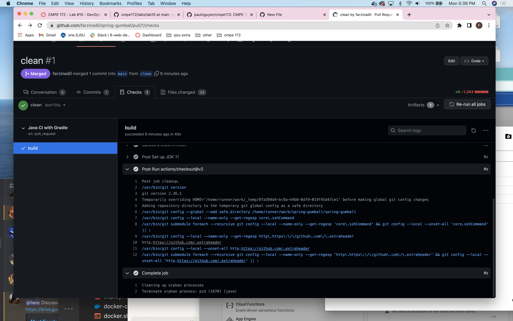
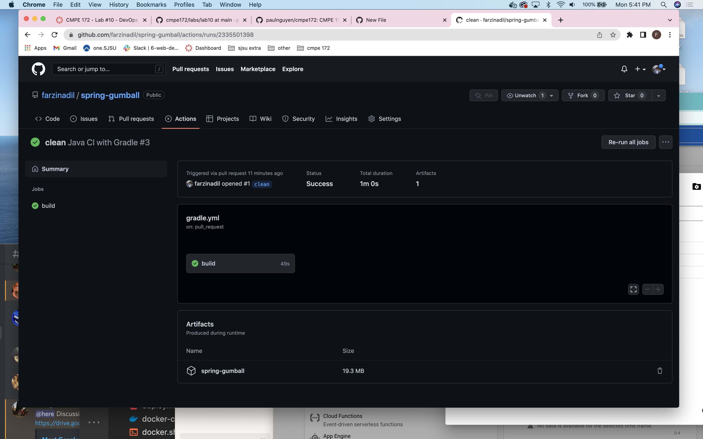

## CD Workflow

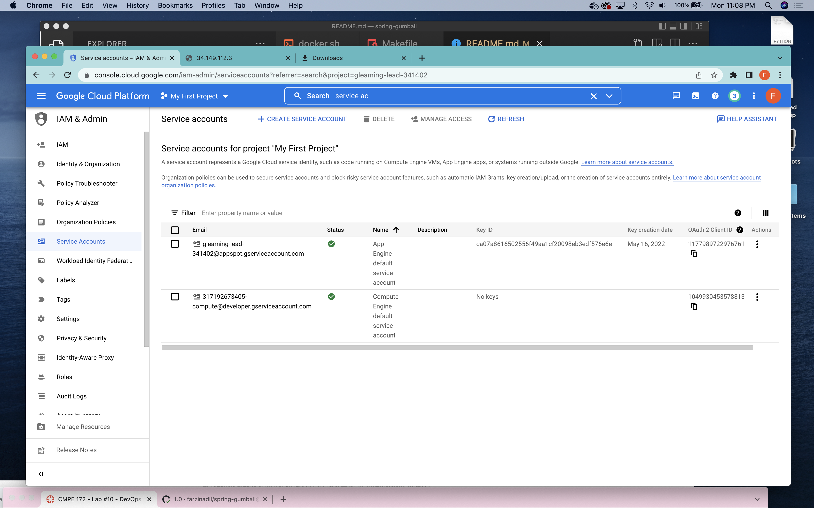
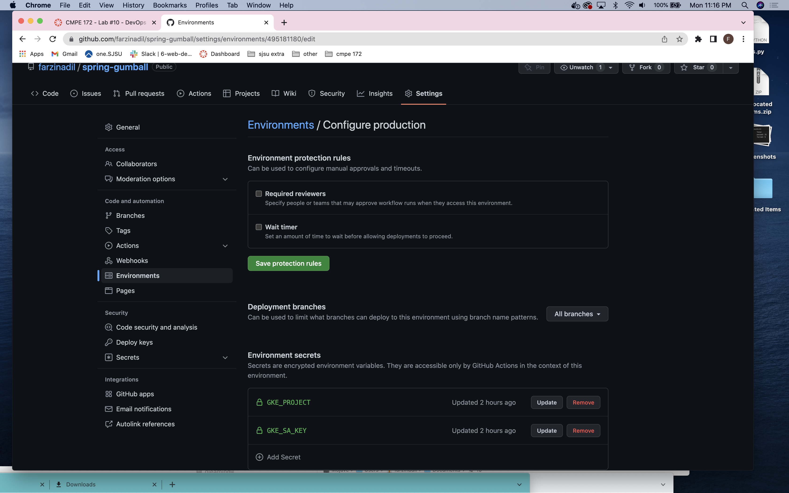
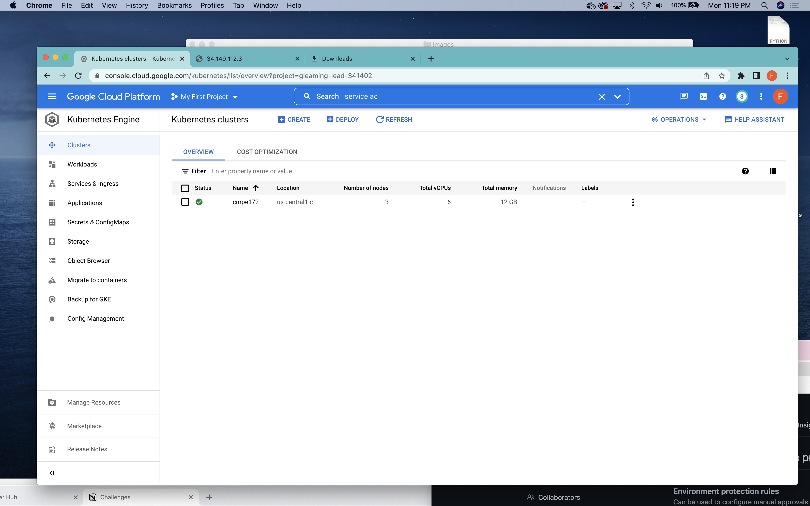
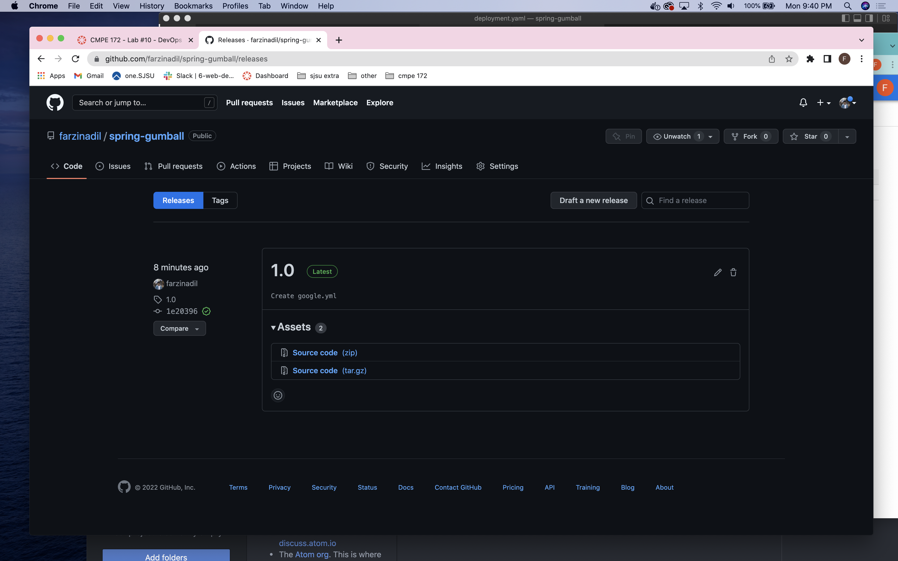
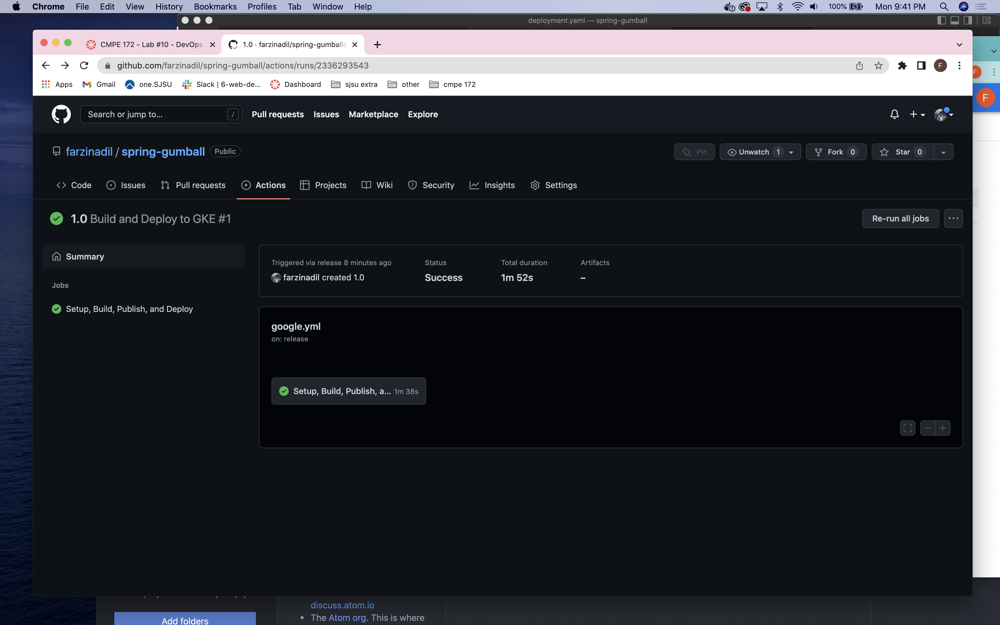
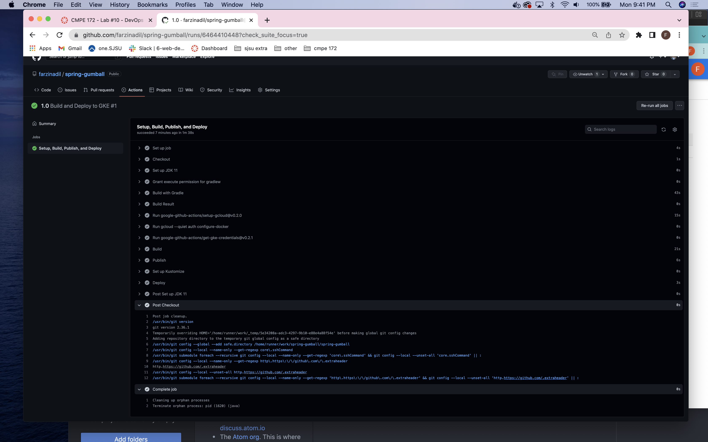
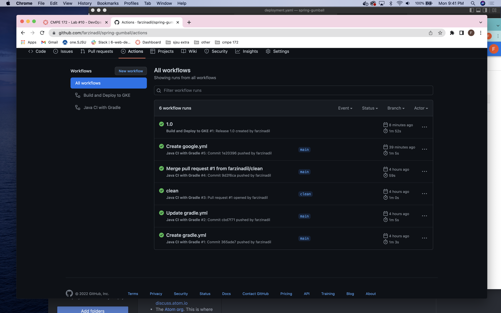
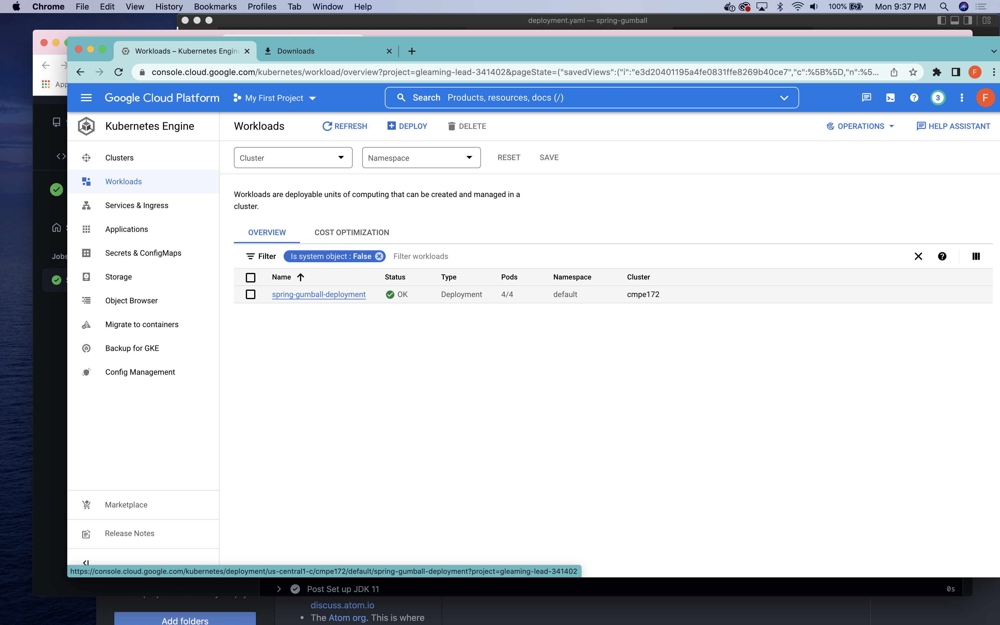
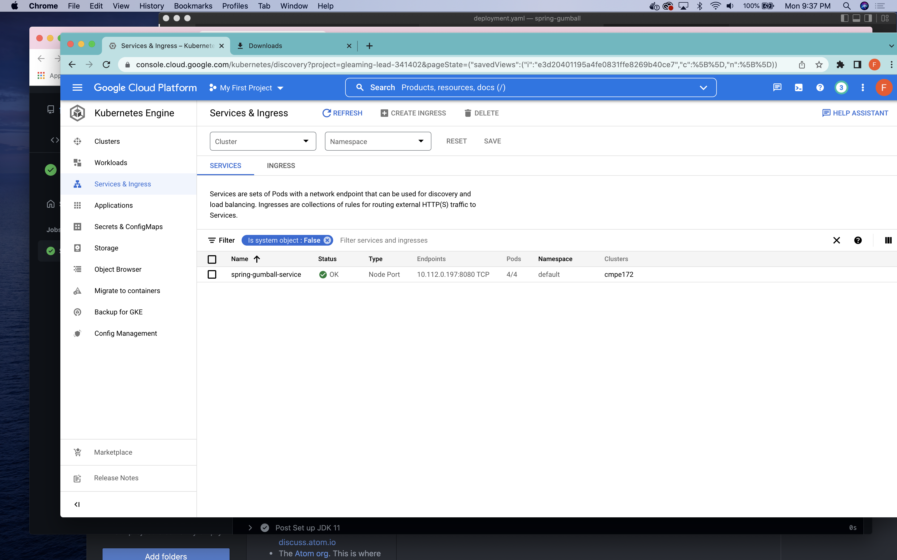
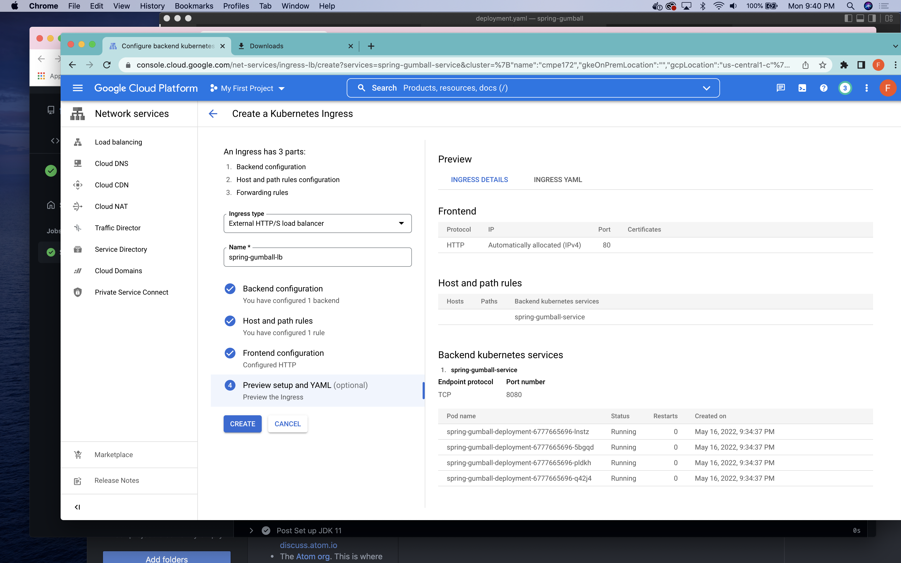
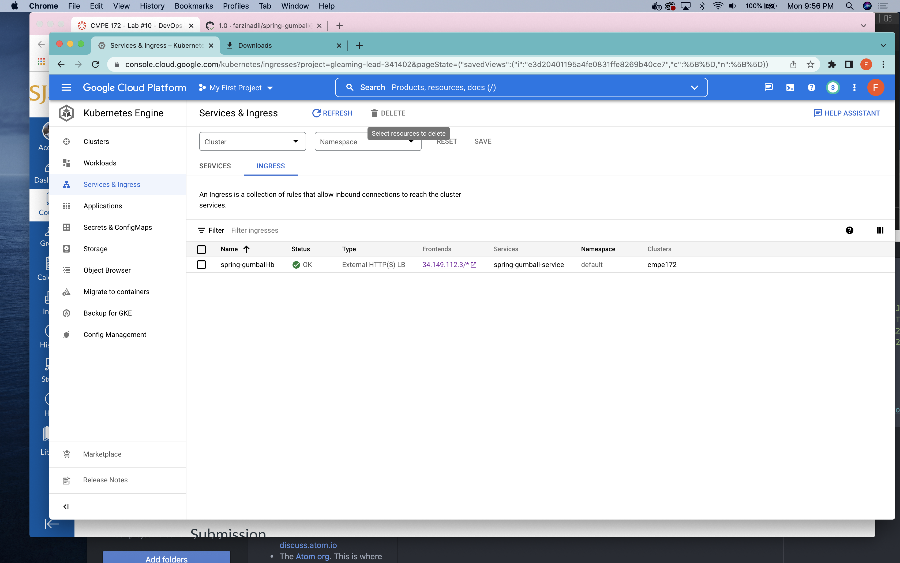
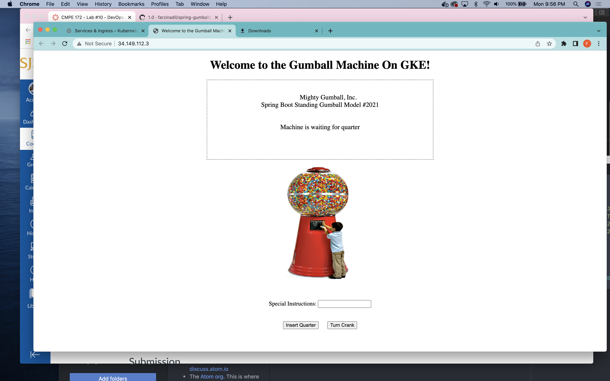

## Notes

I didn't have a key for the project I am using on Google Cloud. I had to create a key and download the json. After downloading it, I was not sure what the value for GKE_SA_KEY would be. The json containts many fields like private_key_id and private_key. I was thinking it had to be one of those at first. Using the wrong key causes the following error:

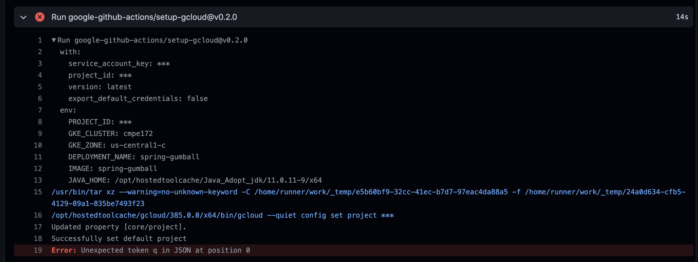

The right value for GKE_SA_KEY is the entire json file.

This part of the google.yml file was confusing at first. 

```    # Get the GKE credentials so we can deploy to the cluster
    - uses: google-github-actions/get-gke-credentials@v0.2.1
      with:
        cluster_name: ${{ env.GKE_CLUSTER }}
        location: ${{ env.GKE_ZONE }}
        credentials: ${{ secrets.GKE_SA_KEY }}
```
After addidng the secrets to Github actions, I thought env variables for GKE_ZONE and GKE_CLUSTER had to be added too. 
I was looking into how to add these to the Github environment. I was using https://docs.github.com/en/actions/learn-github-actions/environment-variables . After going through this, I wasn't able to find the solution but realized that the env variables were supposed to be from Google Cloud. 

